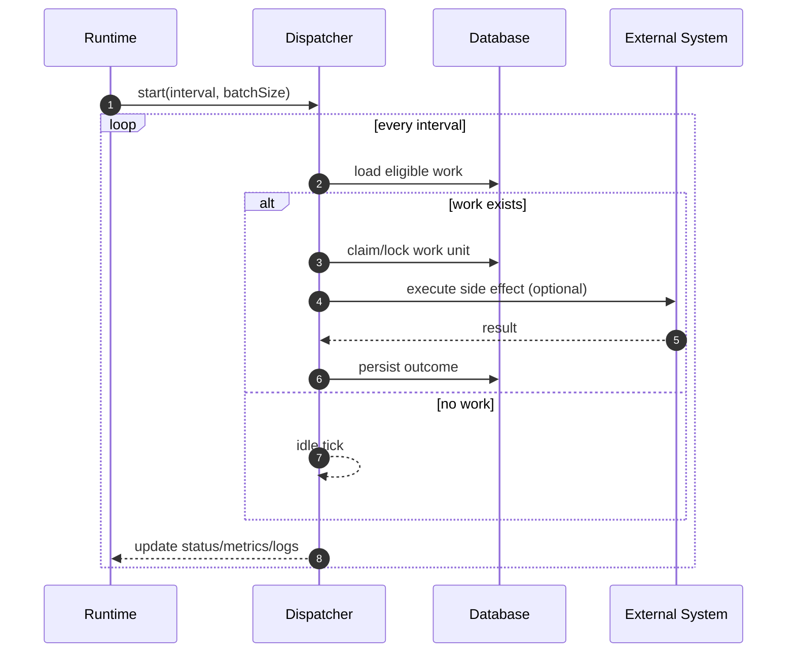

# Dispatcher Pattern in Modula v0 (Academic Notes)

Date: 2026-02-23  
Scope: background workers in backend runtime (`outbox`, `media cleanup`, `KHQR reconciliation`)

## Purpose

This note explains the dispatcher pattern used across Modula v0, why it exists, and how to defend the design in report/presentation.

---

## 1) What “Dispatcher” Means in This Project

A dispatcher is a background runtime loop that:

1. wakes up on a fixed interval,
2. selects eligible work from DB,
3. executes work units safely,
4. records status/metrics/logs,
5. retries naturally on next tick for unfinished work.

This is not a message broker. It is an in-process worker pattern in the modular monolith.

---

## 2) Why We Use Dispatchers

We use dispatchers for tasks that should be **eventually consistent** and should not block HTTP request latency:

- post-commit event publication (outbox),
- stale pending media cleanup,
- payment confirmation convergence (KHQR verify polling).

This keeps write APIs fast while background tasks handle durability/retries.

---

## 3) Runtime Wiring (Single Place)

All dispatchers are started and configured from:

- `src/platform/server/runtime-dispatchers.ts`

This module:

- reads env toggles/intervals/batch sizes,
- starts enabled dispatchers,
- exposes `getStatus()` for `/health`,
- stops all dispatchers on shutdown.

So yes, your statement is correct: the backend uses the same pattern for outbox, media cleanup, and KHQR reconciliation.

---

## 4) Three Dispatchers in Modula v0

| Dispatcher | Source of Work | Main Action | External Call | Core Consistency Goal |
|---|---|---|---|---|
| Outbox | `v0_command_outbox` unpublished rows | publish domain events and mark published | internal event bus | no lost post-commit event |
| Media Cleanup | stale `PENDING` media uploads | delete object from R2 and mark row | Cloudflare R2 | remove orphaned uploads safely |
| KHQR Reconciliation | KHQR attempts waiting/pending-confirmation | verify md5 with provider; persist proof; finalize sale if confirmed | Bakong verify API | payment state convergence |

Key files:

- Outbox: `src/platform/outbox/dispatcher.ts`
- Media cleanup: `src/platform/media-uploads/cleanup-dispatcher.ts`
- KHQR reconcile: `src/modules/v0/platformSystem/khqrPayment/app/reconciliation-dispatcher.ts`

---

## 5) Common Control Skeleton

All three follow a similar control flow:

1. `setInterval(...)` tick.
2. set `lastTickAt`.
3. run core work in `try/catch`.
4. on success: update success counters + `lastSuccessAt`.
5. on failure: update failure counters + `lastFailureAt` + `lastError`.

This gives uniform operational behavior and uniform health reporting.

---

## 6) Sequence Diagram (Generic)

---

## 7) Important Implementation Differences

### A) Outbox Dispatcher

- reads unpublished rows with `FOR UPDATE SKIP LOCKED`,
- publishes to event bus,
- marks `published_at` on success,
- increments retry count on failure.

Design focus: reliable post-commit publication.

### B) Media Cleanup Dispatcher

- claims stale pending upload rows,
- deletes object from R2,
- marks deleted on success,
- reverts to pending on failure.

Design focus: cleanup without losing retriability.

### C) KHQR Reconciliation Dispatcher

- selects attempts in `WAITING_FOR_PAYMENT` / `PENDING_CONFIRMATION`,
- rechecks by recheck-window rule,
- verifies provider proof by md5,
- persists attempt/intent/evidence,
- finalizes sale when confirmed.

Design focus: eventual payment truth and safe sale finalization.

---

## 8) Consistency Model

Dispatcher work is **eventually consistent**:

- request path writes initial state quickly,
- dispatcher converges to final state after.

Consistency boundaries:

- Outbox and KHQR use DB transactions around critical state transitions.
- Media cleanup separates DB claim and external deletion with explicit failure recovery (`markPending`).

---

## 9) Health and Observability

Dispatcher health is exposed by `/health` component status:

- `ok` / `degraded` / `disabled`,
- stale detection (last tick too old),
- failure recency check (`lastFailureAt > lastSuccessAt`),
- task-specific counters (e.g., scanned/applied/failed).

Health resolver logic:

- `src/platform/server/health.ts`

---

## 10) Why This Is Better Than Doing It Inline in Request

If we did these tasks inside the HTTP request:

- latency would be high and unstable,
- retries/recovery would be harder,
- upstream outages (e.g., provider or storage) would directly break user flows.

Dispatcher pattern isolates those risks and provides predictable recovery behavior.

---

## 11) Tradeoffs (for Defense)

Pros:

- resilience and automatic retry,
- lower request latency,
- clear operational status,
- modular background processing.

Cons:

- eventual consistency (not immediate),
- requires tuning intervals/windows,
- needs careful idempotent/retry-safe side effects.

---

## 12) Defense-Ready Summary

Use this statement:

> Modula v0 uses a unified dispatcher pattern for asynchronous backend duties. HTTP writes commit source-of-truth state first, then dispatchers perform retryable background convergence for event publication, storage cleanup, and payment reconciliation.

---

## Related Notes

- `_academic/khqr-reconciliation-dispatcher-in-modula-v0.md`
- `_academic/outbox-pattern-in-modula-v0.md`
- `_academic/duplication_safe_mechanism.md`
