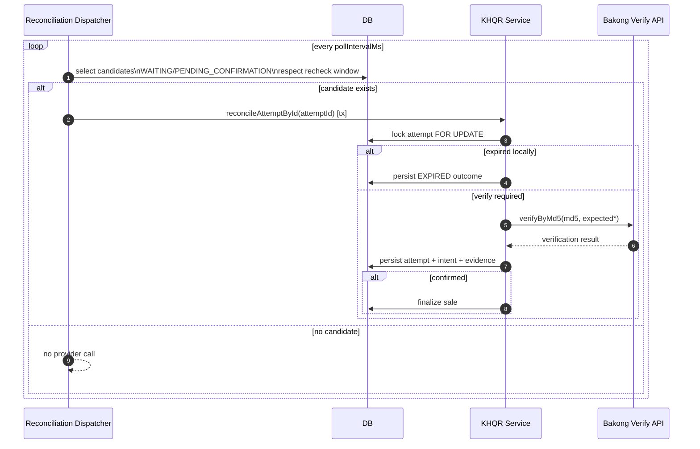

# KHQR Reconciliation Dispatcher in Modula v0 (Academic Notes)

Date: 2026-02-22  
Scope: KHQR payment status convergence for `/v0`

## Purpose

This note explains how Modula v0 reconciles KHQR payments with Bakong using a background dispatcher, why polling is required, and how to defend this design academically.

## 1) Why Dispatcher Exists

In this integration, backend status convergence is done by polling verify APIs, not provider push callbacks.  
So Modula needs a background job to:

1. find unpaid KHQR attempts,
2. re-check provider status,
3. persist proof,
4. finalize sale when confirmed.

Without this dispatcher, paid KHQR attempts can remain `WAITING_FOR_PAYMENT`.

## 2) Where It Is Wired

- Runtime reads env and starts KHQR reconciliation dispatcher: `src/platform/server/runtime-dispatchers.ts:89`
- Dispatcher implementation: `src/modules/v0/platformSystem/khqrPayment/app/reconciliation-dispatcher.ts:30`
- Candidate query: `src/modules/v0/platformSystem/khqrPayment/infra/repository.ts:860`
- Core reconcile use case: `src/modules/v0/platformSystem/khqrPayment/app/service.ts:592`

## 3) Candidate Selection Rule

A row is eligible when:

- `status IN ('WAITING_FOR_PAYMENT', 'PENDING_CONFIRMATION')`
- `last_verification_at` is null OR older than recheck window

Reference: `src/modules/v0/platformSystem/khqrPayment/infra/repository.ts:870`

This prevents re-verifying the same attempt too frequently.

## 4) Dispatcher Tick Algorithm

Per tick:

1. load candidates (`limit`, `recheckWindowMinutes`),
2. iterate candidates,
3. process each candidate in its own DB transaction,
4. track counters (`applied`, `skipped`, `failed`),
5. expose status in health/metrics/logs.

Reference:
- tick loop: `src/modules/v0/platformSystem/khqrPayment/app/reconciliation-dispatcher.ts:55`
- per-attempt transaction: `src/modules/v0/platformSystem/khqrPayment/app/reconciliation-dispatcher.ts:72`

## 5) Reconcile Use Case (Per Attempt)

Inside one transaction:

1. `FOR UPDATE` lock attempt by ID.
2. If terminal (`PAID_CONFIRMED`, `SUPERSEDED`, `EXPIRED`, `CANCELLED`) => skip.
3. If locally expired by `expires_at` => synthetic `EXPIRED` proof.
4. Else call provider `verifyByMd5`.
5. Normalize verification result.
6. Persist outcome on attempt + payment intent + evidence row.
7. If now `PAID_CONFIRMED`, finalize sale (or materialize from intent snapshot then finalize).

References:
- lock + terminal skip: `src/modules/v0/platformSystem/khqrPayment/app/service.ts:595`
- synthetic expiry vs provider verify: `src/modules/v0/platformSystem/khqrPayment/app/service.ts:617`
- persist verification outcome: `src/modules/v0/platformSystem/khqrPayment/app/service.ts:649`
- finalize flow: `src/modules/v0/platformSystem/khqrPayment/app/service.ts:886`

## 6) Status Mapping (Important for Defense)

Attempt status transitions:

- `CONFIRMED` -> `PAID_CONFIRMED`
- `MISMATCH` -> `PENDING_CONFIRMATION`
- `EXPIRED` -> `EXPIRED`
- `UNPAID`/`NOT_FOUND` -> stays waiting state, with reason code updated

Reference: `src/modules/v0/platformSystem/khqrPayment/infra/repository.ts:1121`

Payment intent transitions:

- `CONFIRMED` -> `PAID_CONFIRMED`
- `MISMATCH` -> `FAILED_PROOF`
- `EXPIRED` -> `EXPIRED`

Reference: `src/modules/v0/platformSystem/khqrPayment/infra/repository.ts:780`

## 7) Consistency Guarantees

Per-attempt processing is transactional:

- verification outcome persistence,
- payment-intent state update,
- evidence insert,
- sale finalization (if confirmed),

all happen atomically in one DB transaction per candidate.

This prevents partial reconciliation (e.g., attempt marked paid but sale not finalized).

## 8) Operational Tuning

Env knobs:

- `V0_KHQR_RECONCILIATION_ENABLED`
- `V0_KHQR_RECONCILIATION_INTERVAL_MS`
- `V0_KHQR_RECONCILIATION_BATCH_SIZE`
- `V0_KHQR_RECONCILIATION_RECHECK_WINDOW_MINUTES`

Wiring: `src/platform/server/runtime-dispatchers.ts:89`

Practical profiles:

- **Dev fast feedback**: interval `3000`, recheck window `0`
- **Prod baseline**: interval `10000-30000`, recheck window `1-3`

## 9) Failure Modes and Responses

1. **Provider timeout/error**
   - Attempt remains eligible for next tick.
   - Tick logs failure and continues other attempts.

2. **Row locked / transient DB issues**
   - Candidate fails this tick only.
   - Retry naturally occurs next tick.

3. **Paid after first UNPAID check**
   - Converges on later tick based on interval + recheck window.

4. **Process restart**
   - No in-memory queue loss problem; source of truth is DB rows.

## 10) Sequence Diagram

## 11) Defense-Ready Summary

Use this statement:

> Modula v0 uses a DB-driven reconciliation dispatcher to poll provider verification for only eligible KHQR attempts. Each attempt is reconciled in its own transaction, persisting proof and finalizing sale atomically when confirmed.

## 12) Related Notes

- `_academic/duplication_safe_mechanism.md`
- `_academic/outbox-pattern-in-modula-v0.md`
- `_academic/offline-first-architecture-modula-v0.md`
