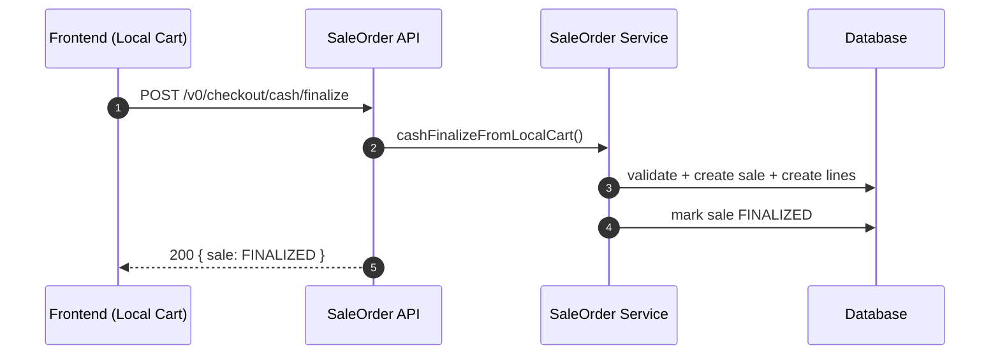
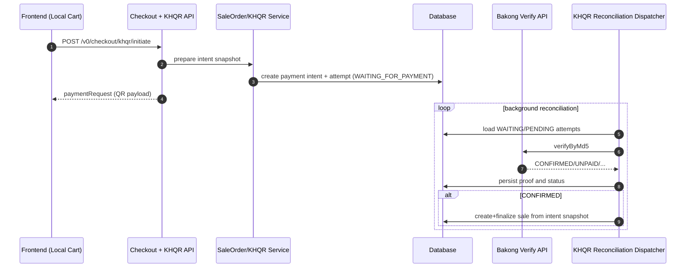
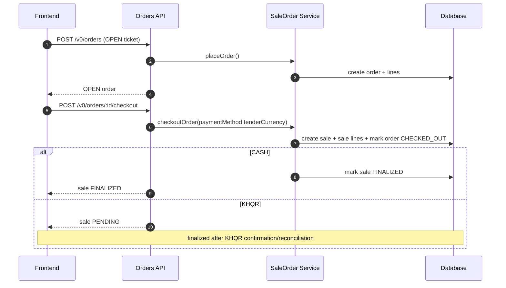

# Sale Processing Flow in Modula v0 (Academic Notes)

Date: 2026-02-23  
Scope: `/v0` POS sale lifecycle (pay-now + pay-later, USD/KHR tender)

## Purpose

This note documents the canonical sale processing model currently implemented in backend:

- two major business lanes: **pay now** and **pay later**,
- each lane supports **USD** or **KHR** tender currency,
- payment method can be **CASH** or **KHQR** depending on endpoint.

---

## 1) Core Model

## A) Pay-now lane (no server-side order ticket)

- Source: local cart on client.
- Backend records sale only during checkout commands.
- Endpoints:
  - `POST /v0/checkout/cash/finalize`
  - `POST /v0/checkout/khqr/initiate` (+ KHQR confirmation/reconciliation)

## B) Pay-later lane (order ticket workflow)

- Source: server-side order ticket (`/v0/orders*`).
- User can add items while order is `OPEN`.
- Settlement happens later using:
  - `POST /v0/orders/:orderId/checkout` with `paymentMethod = CASH | KHQR`.

---

## 2) Flow Matrix (Business-Accurate)

| Lane | Payment Method | Tender Currency | Immediate Result | Final Result |
|---|---|---|---|---|
| Pay now | CASH | USD or KHR | sale written + finalized in same command | `SALE FINALIZED` |
| Pay now | KHQR | USD or KHR | payment intent + attempt created, no sale row yet | sale is created/finalized after KHQR confirmation |
| Pay later | CASH | USD or KHR | order checkout creates sale and finalizes in same command | `ORDER CHECKED_OUT` + `SALE FINALIZED` |
| Pay later | KHQR | USD or KHR | order checkout creates `PENDING` sale | finalized after KHQR confirmation |

---

## 3) Currency and Amount Rules

Checkout pricing supports dual-currency snapshots:

- `grandTotalUsd`, `grandTotalKhr`
- `tenderCurrency` = `USD | KHR`
- `tenderAmount` defaults to the grand total in selected tender currency

Validation rules:

1. **KHQR**: `tenderAmount` must match selected grand total.
2. **CASH**: `tenderAmount` must match selected grand total.
3. **CASH**: `cashReceivedTenderAmount >= tenderAmount`.

Reference: `parseCheckoutBody(...)` in `src/modules/v0/posOperation/saleOrder/app/service.ts:1376`

---

## 4) Preconditions

Both lanes require branch working context and open session constraints:

- branch context required,
- open cash session required before checkout/order writes.

Pay-later additionally requires branch policy `saleAllowPayLater = true` for order placement/edit.

References:
- open session guard: `src/modules/v0/posOperation/saleOrder/app/service.ts:1122`
- pay-later guard: `src/modules/v0/posOperation/saleOrder/app/service.ts:1138`

---

## 5) Sequence — Pay Now (Cash)

---

## 6) Sequence — Pay Now (KHQR)

---

## 7) Sequence — Pay Later (Order Ticket)

---

## 8) Status Semantics

- `OrderStatus`: `OPEN | CHECKED_OUT | CANCELLED`
- `SaleStatus`: `PENDING | FINALIZED | VOID_PENDING | VOIDED`

Interpretation:

- `PENDING` sale is mainly KHQR waiting/proof pending.
- `FINALIZED` is accounting/stock-meaningful committed sale.

---

## 9) Why This Design Is Defensible

1. Separates business lanes cleanly: immediate settlement vs deferred settlement.
2. Supports dual-currency tender without duplicating lane logic.
3. Enforces strict amount constraints per payment method.
4. Keeps KHQR eventually consistent through reconciliation dispatcher.
5. Preserves auditability and deterministic transitions.

---

## 10) Quick Defense Statement

Use this line:

> Modula v0 models sale processing with two explicit lanes—pay-now and pay-later—while supporting USD/KHR tender in both. Cash settles synchronously; KHQR settles asynchronously through reconciliation, with strict amount validation and deterministic state transitions.

---

## Related Docs

- `api_contract/sale-order-v0.md`
- `_academic/khqr-reconciliation-dispatcher-in-modula-v0.md`
- `_academic/dispatcher-pattern-in-modula-v0.md`
