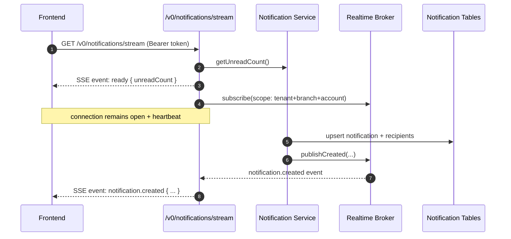

# Server-Sent Events (SSE) in Modula v0 (Academic Notes)

Date: 2026-02-23  
Scope: backend-to-frontend realtime notification channel in `/v0`

## Purpose

This note explains **what SSE is** (for readers with zero prior knowledge), why it exists, and how Modula v0 uses it today.

---

## 1) What SSE Is

**Server-Sent Events (SSE)** is a web standard for **one-way realtime communication**:

- server -> client: yes
- client -> server: no (use normal HTTP requests for that)

The client opens a long-lived HTTP connection, and the server keeps pushing events on that same connection.

Think of SSE as:

- “subscribe once”
- then “server keeps sending updates”
- until client disconnects.

---

## 2) Core SSE Model (No Prior Knowledge Assumed)

### A) Transport

- SSE uses normal HTTP (`text/event-stream`), not WebSocket upgrade.
- Connection stays open.
- Server writes small event frames as text.

### B) Event Frame Format

Typical SSE frame:

```text
event: notification.created
data: {"notificationId":"...","title":"..."}

```

Important fields:

- `event:` logical event name
- `data:` JSON payload (string on the wire)
- blank line ends one event frame

Optional fields:

- `retry:` reconnection hint in ms
- `id:` event id for resume semantics

### C) Reconnect Behavior

If network breaks, client reconnects automatically (depending on client implementation).  
Server can suggest retry interval with `retry:`.

---

## 3) SSE vs Polling vs WebSocket

### SSE vs Polling

- Polling repeatedly asks “any update?”
- SSE keeps a single open stream and pushes updates immediately.

Result: lower latency and less request churn for notification-style updates.

### SSE vs WebSocket

- WebSocket is full duplex (both directions).
- SSE is simpler for server->client only.

For notification inbox updates, SSE is usually enough and simpler to operate.

---

## 4) Where SSE Is Used in Modula v0

Current realtime endpoint:

- `GET /v0/notifications/stream`

Router implementation:

- `src/modules/v0/platformSystem/operationalNotification/api/router.ts`

Mount path:

- `src/platform/http/routes/v0.ts`

This stream is scoped by authenticated context:

- `accountId`
- `tenantId`
- `branchId`

---

## 5) Request/Response Contract in This Project

### Request

- Method: `GET`
- URL: `/v0/notifications/stream`
- Auth required: `Bearer accessToken`
- Context required in token: tenant + branch

### Initial stream setup

Server sends:

- headers:
  - `Content-Type: text/event-stream`
  - `Cache-Control: no-cache, no-transform`
  - `Connection: keep-alive`
- `retry: 3000`
- `ready` event containing current unread count

Then server keeps connection alive with heartbeat comments.

---

## 6) How It Works Internally in Modula

### A) Stream lifecycle

When frontend calls `/v0/notifications/stream`:

1. Backend authenticates and resolves actor scope.
2. Backend starts SSE stream.
3. Backend emits initial `ready` event.
4. Backend subscribes this client to an in-memory realtime broker.
5. Backend sends heartbeat every 25 seconds.
6. On socket close/abort, backend unsubscribes and cleans up.

Main code:

- stream setup + heartbeat:  
  `src/modules/v0/platformSystem/operationalNotification/api/router.ts`

### B) Publish path

When backend emits an operational notification:

1. Save notification row in DB.
2. Save recipients rows in DB.
3. Append pull-sync change (durable sync lane).
4. Publish in-memory realtime event to matching online subscribers.

Main code:

- emit service:  
  `src/modules/v0/platformSystem/operationalNotification/app/service.ts`
- realtime broker:  
  `src/modules/v0/platformSystem/operationalNotification/app/realtime.ts`

### C) Scope isolation

Broker key is:

`tenantId:branchId:accountId`

So only matching recipient scope gets pushed events.

---

## 7) Sequence Diagram (Modula SSE Notification Path)



---

## 8) Delivery Semantics (Important for Defense)

SSE in this implementation is **realtime convenience**, not the only truth source.

- If client is connected, notification arrives immediately.
- If client is offline/disconnected, SSE event is missed in real time.
- Durable recovery path exists via:
  - inbox query APIs, and
  - pull-sync changes (`operationalNotification` module stream).

So SSE gives low-latency UX, while DB + pull-sync preserve correctness.

---

## 9) Practical Limitations of SSE (Mobile Included)

SSE limitations that should be stated explicitly:

1. **No delivery to closed app sessions**  
   If mobile app is terminated/closed, SSE connection does not exist, so event is not delivered in realtime.

2. **Background reliability is OS-limited**  
   On mobile, background execution and long-lived sockets are restricted; SSE may pause or disconnect.

3. **Not a replacement for mobile push notifications**  
   For “app closed” alerts, backend must use `FCM`/`APNs`; SSE alone is not sufficient.

4. **Client must reconnect and resync**  
   After reconnect, frontend should use inbox/pull-sync to recover missed events.

Conclusion:

> SSE is suitable for in-app realtime updates while the app/session is active, but not as the sole notification channel for mobile apps.

---

## 10) Current Limitation Relevant to KHQR

At this time, operational notification subscribers are wired for cash-session events.  
KHQR confirmation/finalization is reconciled via payment flows and sync state, but not yet emitted as an operational notification SSE event by default.

Implication:

- frontend should still rely on checkout/intent APIs and/or pull-sync for payment-state truth,
- SSE currently covers notification use cases already wired to emitter subscribers.

---

## 11) Why This Design Is Defensible

1. Uses simple HTTP-native push model for one-way updates.
2. Keeps write path source-of-truth in DB, not in volatile socket state.
3. Separates concerns:
   - realtime UX channel (SSE),
   - durable state convergence channel (pull-sync + DB).
4. Supports scoped multitenancy by tenant/branch/account.

---

## 12) Short Defense Statement

Use this line:

> In Modula v0, SSE is the low-latency server-to-client notification channel, while DB and pull-sync remain the durable source of truth; this combination provides both responsive UX and correctness under disconnects.

---

## Related Notes

- `_academic/dispatcher-pattern-in-modula-v0.md`
- `_academic/khqr-reconciliation-dispatcher-in-modula-v0.md`
- `_academic/sale-processing-flow-in-modula-v0.md`
